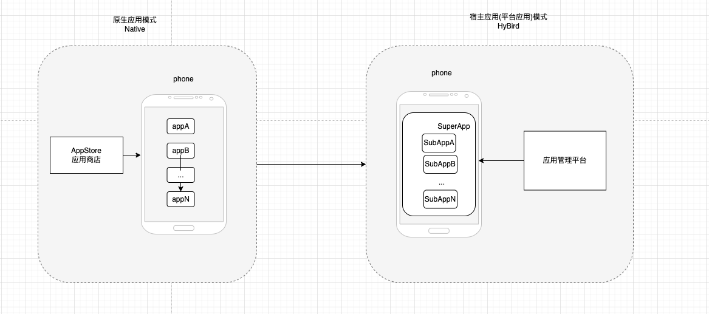
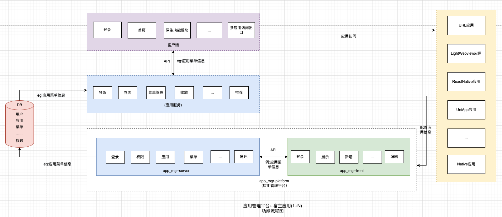

# APP应用管理平台解决方案📱

这里介绍一种将多APP功能合并到一个宿主APP，并配合应用管理平台的解决方案，涉及到服务、客户端、前端展示。类似于微信+小程序+公众平台。

## 介绍

之前介绍了类微信小程序，公众号的实现原理,如需了解请点击[LightWebViewBridge](https://github.com/thorjay/LightWebviewBridge)。

基于这种实现机制，我们可以创造性地创建一种HyBirdAPP应用的开发及运行模式。由Phone+Native纯原生应用+AppStore，切换到Phone+HyBird应用+应用管理平台 这种模式,如下图；微信+小程序(公众号)也是这种方向,可以参考下面的<小程序技术选型>👇🏻。

优点：

1.无需安装多个应用，1个宿主应用(超级应用SuperApp)即可(类似微信)；

2.功能模块化，即开即用，无需应用商店安装更新；以子应用(SubApp)形式存在于宿主应用当中，类型小程序、公众号、订阅号等形式存在。

3.一个统一的应用管理平台进行管理多个子应用的上架、下架、更新等，类似于微信公众平台。

缺点：

1.性能，可能界面、交互和部分简单原生功能够通过HyBrid方式完成功能。但程序和设备系统之间多了一个Web层，复杂的原生功能及通信肯定会受限。

## 应用管理平台+宿主APP(1+N)

* 宿主APP:

  1：指所有子应用、子功能、子程序共有的核心应用。共有功能、共有服务等等功能载体APP，比如像登录、账号信息管理、设置等等。可以参考微信APP。

  N：值所有的子应用、子程序、子功能。它们是动态地被加载到宿主APP上。即开即用，比如像小程序、公众号等，都是实现秒开，直接在微信上直接使用功能。

* 应用管理平台(app_mgr_platform):

  对所有N子应用进行管理，实现新增应用、编排应用、编辑应用属性、删除等等功能。比如像微信公众服务平台，就是对小程序、公众号进行了统一管理。

## 功能实现流程👈🏻

## 效果

应用管理平台：

## 功能点

* [x] HyBird应用加载、运行SDK[JS-SDK](https://github.com/thorjay/LightWebviewBridge)
* [x] Hibrid子应用的动态资源下载、更新
* [x] URL子应用的加载
* [x] Native子引用的加载
* [x] RN子应用的加载
* [ ] UniApp子应用的加载
* [ ] Flutter子应用的加载
* [x] 应用管理平台的搭建

## 参考

[小程序技术选型](https://developers.weixin.qq.com/ebook?action=get_post_info&token=935589521&volumn=1&lang=zh_CN&book=miniprogram&docid=0006a2289c8bb0bb0086ee8c056c0a)

由于小程序的宿主是微信，所以我们不太可能用纯客户端原生技术来编写小程序 。...因此，我们需要像Web 技术那样，有一份随时可更新的资源包放在云端，通过下载到本地，动态执行后即可渲染出界面。

我们选择类似于微信 JSSDK 这样的 Hybrid 技术，即界面主要由成熟的 Web 技术渲染，辅之以大量的接口提供丰富的客户端原生能力。

每个小程序页面都是用不同的WebView去渲染，这样可以提供更好的交互体验，更贴近原生体验，也避免了单个WebView的任务过于繁重。
## 模块结构
### 服务端

### 客户端

### 前端